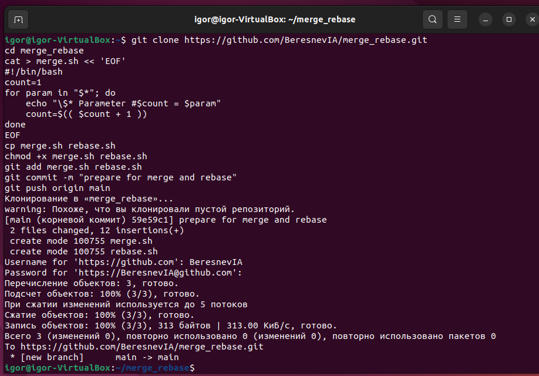
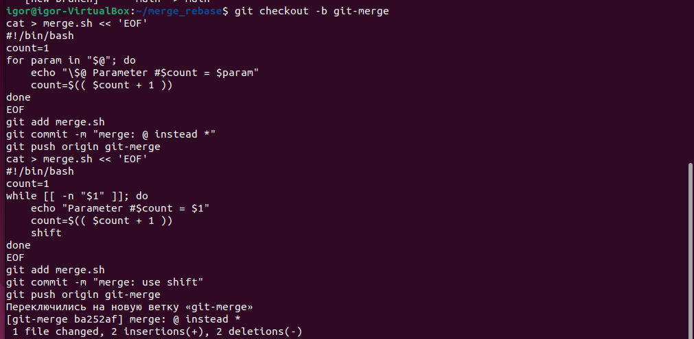
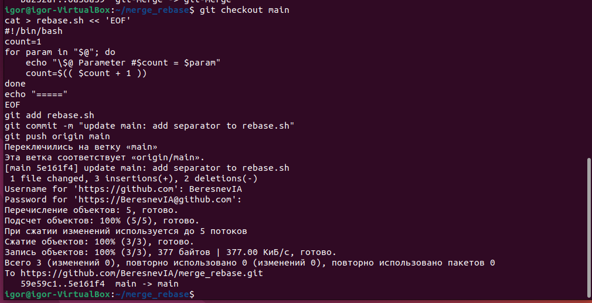
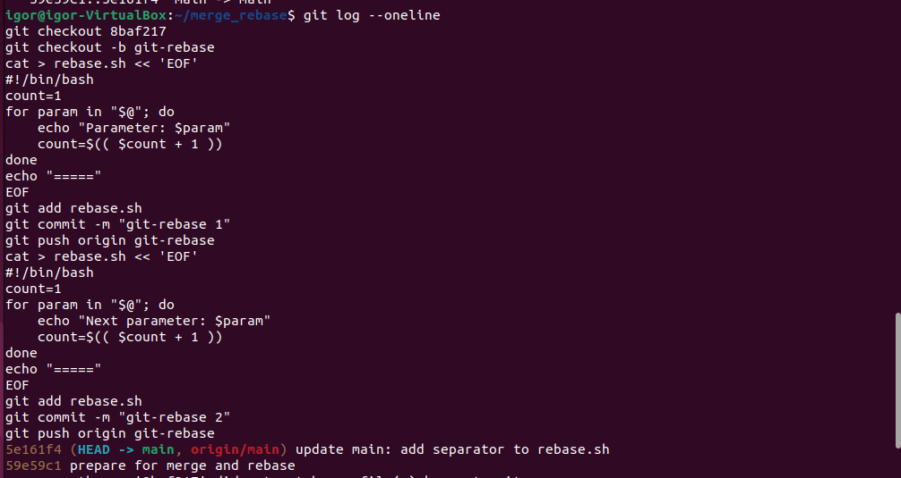
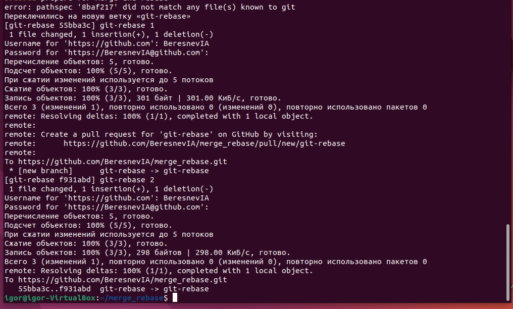
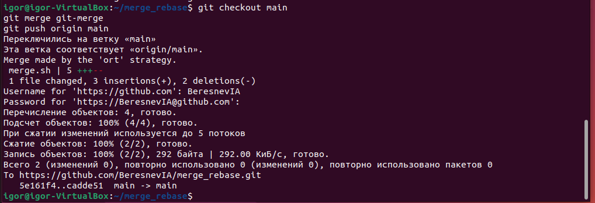
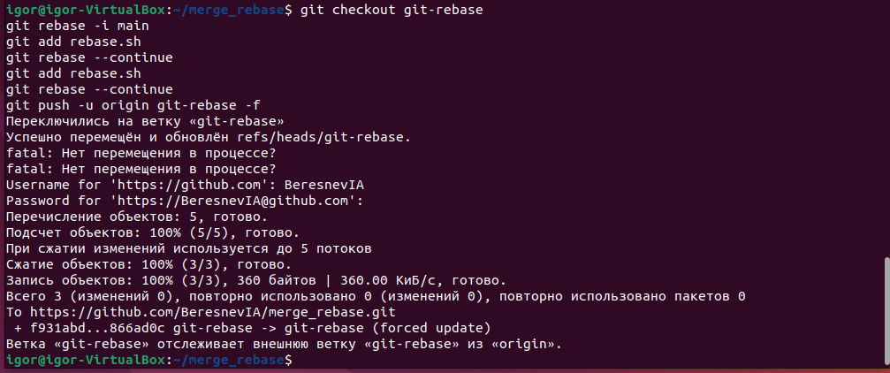
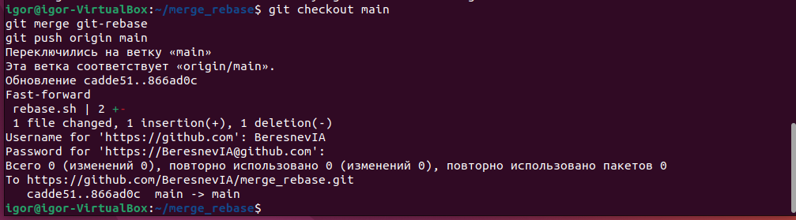

# Домашнее задание к занятию «Ветвления в Git»
Выполнил: Береснев Игорь Андреевич

---

Клонирование и создание файлов

### Скриншот клонирования и создание файлов

Создание ветки git-merge

### Скриншот создания ветки git-merge

Изменение main

### Скриншот изменения main

Создание ветки git-rebase от старого коммита

### Скриншот ветки git-rebase

Выполнено слияние ветки git-merge в main

### Скриншот слияния

Выполнен интерактивный rebase с объединением коммитов

### Скриншот выполнения интерактивного rebase с объединением коммитов

Ветка git-rebase слита в main через fast-forward.

### Скриншот слияния ветки

